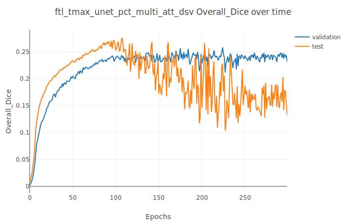
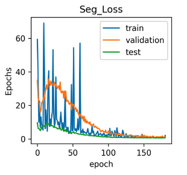
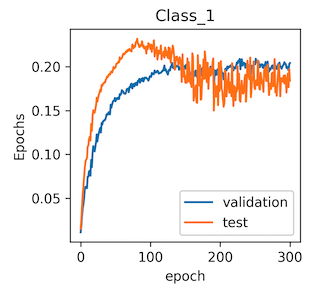

# Project journal
## Implementing binary single output channel

|Start Date|End Date  |
|----------|----------|
|2020-04-25|2020-04-26|

### Description

Implemented binary prediction for the existing multi-Class attention-gated Unet
ie. the unet can now also output a single binary channel

### Delivrables

- [x] Dice loss with binary channel
- [x] Visualisation, prediction and plotting for binary channels

|2 output channels|1 output channel  |
|----------|----------|
| | |

### Conclusion

- Unet is correctly implemented
- Multi-channel prediction remains superior in terms of convergence  

##  Focal Tversky loss

|Start Date|End Date  |
|----------|----------|
|2020-04-26|2020-04-26|

Implemented focal Tversky (FT) loss function with multi-channel output.  

|FT-Loss over time|Dice over time with FT as loss  |
|----------|----------|
| | |

### Conclusion

- Focal tversky loss performs well
- Similar overall performance when comparing to dice loss with 2 output channels
- Maybe more accurate on small segments
- Maybe more prone to overfitting

## Standardisation 

|Start Date|End Date  |
|----------|----------|
|2020-06-01|2020-06-30|

Contributor: [Quentin Uhl](https://github.com/QuentinUhl)

Implemented image-wise standardisation to obtain zero mean and unit standard deviation. 

|Dice without standardisation|Dice with standardisation  |
|----------|----------|
| <br/><br/> Best Validation Dice:  0.211099805|   <br/><br/> Best Validation Dice:  0.222637893|

### Conclusion

- Standardisation seems to improve performance slightly.
- However, stability (and resistance to overfitting?) seems to be worse.

## Optimisation algorithm 

|Start Date|End Date  |
|----------|----------|
|2020-07-10|2020-07-13|

Tested adam optimizer and learning rate adaptation "Plateau" policy, as this combination has been reported to perform particularly with our architecture on the [MLEBE dataset](https://github.com/Jimmy2027/MLEBE). 
We thus compare stochastic gradient descent (SGD) with Adam as optimizer as well as a "Step" vs a "Plateau" learning rate adaption strategy. 

Definitions of learning rate strategies:
````python
from torch.optim.lr_scheduler import StepLR, ReduceLROnPlateau
# Step:
StepLR(optimizer, step_size=250, gamma=0.5)
# Plateau
ReduceLROnPlateau(optimizer, mode='min', factor=0.1, threshold=0.01, patience=5)
````

|Optimizer & LR policy | SGD | Adam  |
|----------|----------|----------|
| Step LR |  <br/><br/> Best Validation Dice:  0.222637893 <br/> Epoch: 186 |   <br/><br/> Best Validation Dice:  0.201341671 <br/> Epoch: 115|
| Reduce LR on plateau |  <br/><br/> Best Validation Dice:  0.080664843 <br/> Epoch: 67|   <br/><br/> Best Validation Dice:  0.20092963 <br/> Epoch: 123|

### Conclusion

- SGD with LR step policy still seems to perform best on the gsd dataset. 
- Adam seems to train faster. 
- LR plateau policy seems to offer more stability for Adam
- LR plateau policy performs terribly with SGD

As some future architectural changes might change the outcome of this comparison, SGD with LR step vs. Adam with plateau should be integrated in a future hyperoptimisation.

## Weight decay

|Start Date|End Date  |
|----------|----------|
|2020-07-25|2020-07-26|

Evaluated weight decay to reduce overfitting. 

|Model |Lambda 10<sup>-4</sup> | Lambda 10<sup>-2</sup>  | Lambda 10<sup>-1</sup>| 
|----------|----------|----------|----------|
| Dice Loss | | | |
| Best validation class 1 dice |0.224319922| 0.22760875| 0.200507353
| Best validation epoch | 120|219| 99

### Conclusion

- Adjusting weight decay is effective in reducing overfitting.
- However, weight decay slows down overall learning
- At lambda 10<sup>-1</sup>, weight decay begins to hurt performance
- Weight decay should be integrated in a future grid search


##  Combined loss

|Start Date|End Date  |
|----------|----------|
|2020-07-17|2020-07-31|

Inspired by the [work by Yu et al](https://jamanetwork.com/journals/jamanetworkopen/fullarticle/2762679), we evaluated a combined loss defined as follows:
`Loss = Weighted binary cross entropy + L1 loss + 0.5×(1 – DSC) + 0.25×Volume loss`

### Losses

Class wise implementations:
- Single class: Computed only for Stroke presence
- Multi class: mean computed for all classes (thus stroke presence and absence)

#### *Weighted binary cross-entropy loss* 
 <br>


#### *Volume loss* 

- Volume loss is not differentiable (as max/threshold is not differentiable) and has thus to be combined with another loss. 
- Single class volume loss high spikes are due to augmented train volumes with no lesion visible

#### *L1 loss* 


#### *Tversky and focal tversky loss* 

Original work by [Salehi et al](https://arxiv.org/abs/1706.05721) and [Abraham et al.](https://arxiv.org/abs/1810.07842v1)

 <br>


|Loss|Loss Evolution|Dice over time| Best validation dice | Best validation epoch |
|----------|----------|----------|----------|----------|
|Multi class Dice loss| | | 0.222637893 | 186 |
|Single class Dice loss| | | 0.213009384 | 301 |
|L1 loss| | | 0.005964876 | 14 |
|WBCE loss| | | 0.127579561 | 172 |
|Single class Volume + Dice loss| | | 0.210912979 | 176 |
|Combined Loss| | | 0.20187068 | 106 |
|Multi class Volume + Dice loss| | | 0.207735219 | 182 |
|Multi class focal tversky loss| | | 0.209134249 | 251 |
|Single class focal tversky loss| | | 0.225328473 | 201 |

### Conclusion

- combined loss with single class volume loss seems to converge slightly faster
- combined loss yields worse results than dice loss alone on validation, with probably smaller std 

##  2.5 Dimensional input

|Start Date|End Date  |
|----------|----------|
|2020-07-01|2020-12-15|

Method: Use slabs along z-axis to infer segmentation on middle slice. 
- convZ: in the final step, the slab is convolved into a single slice
- poolZ: in the final step, the slab is maxpooled into a single slice

Original idea and work by [Xue et al](https://www.sciencedirect.com/science/article/pii/S2213158219304656).

Tested with 'single_class_combined_loss'

|Method| Loss | Dice over time| Best validation dice (Overall dice)| Best validation epoch |
|----------|----------|----------|----------|----------|
|Standard 3D| Single Class Combined Loss | | 0.124896301 | 270 |
|2.5D, convZ| Single Class Combined Loss | | 0.234612097 | 186 |
|2.5D, poolZ| Single Class Combined Loss | | 0.249026386 | 170 |
|Standard 3D| Dice Loss | | 0.294284873 | 235 |
|2.5D, convZ| Dice Loss | | 0.22015214 | 279 |
|2.5D, poolZ| Dice Loss | | 0.220600992 | 326 |

## Issues

- 2.5D shows sign of instability with pure dice loss function (predicts only 0 after some time)

### Conclusion

- No clear improvement of 2.5D over full 3D and is mostly slower
- combined loss should be used for 2.5D network

##  Bayesian Skip Net

|Start Date|End Date  |
|----------|----------|
|2020-07-01|2020-08-01|

Perfusion CT is widely used in acute ischemic stroke to determine eligibility for acute treatment, by defining an ischemic core and penumbra. In this work presented at the Brain Lesion Workshop at MICCAI 2020, we used a novel way of building on prior information for the automatic prediction and segmentation of stroke lesions. We reformulate the task to identify differences from a prior segmentation by extending a three-dimensional Attention Gated Unet with a skip connection allowing only an unchanged prior to bypass most of the network. We show that this technique improves results obtained by a baseline Attention Gated Unet on both the Geneva Stroke Dataset and the ISLES 2018 dataset.

Data: perfusion maps, ncct, core prior 

### Video explanation

Click on the image below:

[](https://www.youtube.com/watch?v=PbyxpUMV8-w)

### Comparison

|Method| Dice over time| Best validation dice (Class 1) | Best validation epoch |
|----------|----------|----------|----------|
|Standard Unet| | 0.253963743 | 192 |
|Bayesian Skip Net| | 0.348940217 | 187 |

Experimental results on test and validation splits for the Geneva Stroke Dataset. The results are reported in terms of mean and standard deviation for Dice score, precision and recall. The proposed Unet with bayesian skip with Method A) and B) is benchmarked against the baseline Attention Gated Unet. The prior segmentation's performance is reported as reference. Best model results in bold.


|Data Split|Method| Dice | Precision | Recall |
|----------|----------|----------|----------|----------|
| Validation | Prior | 0.125 +/- 0.135  |  0.149 +/-  0.128 | 0.171 +/- 0.194 |
| Validation | Unet | 0.270 +/- 0.215 | 0.265 +/- 0.299 | **0.404** +/- 0.336 |
| Validation | Unet+Method A |  0.246 +/- 0.206 | 0.221 +/- 0.247 | 0.300 +/- 0.299 |
| Validation | Unet+Method B | **0.292** +/- 0.211 | **0.348** +/- 0.333 | 0.294 +/- 0.257 |
| Test | Prior | 0.099 +/- 0.110 | 0.109 +/- 0.116 | 0.119 +/- 0.163 |
| Test | Unet | 0.192 +/- 0.156 | 0.189 +/- 0.235 | **0.271** +/- 0.284 |
| Test | Unet+Method A | 0.181 +/- 0.154 | 0.132 +/- 0.187 | 0.278 +/- 0.324 |
| Test | Unet+Method B | **0.212** +/- 0.136 | **0.289** +/- 0.333 | 0.188 +/- 0.219 |

Please refer to the corresponding paper and talk for more details. 

##  Comparison to Yunet

|Start Date|End Date  |
|----------|----------|
|2021-01-01|2020-01-30|

Original paper by Yu et al [here.](https://jamanetwork.com/journals/jamanetworkopen/fullarticle/2762679)
Code adaptation [here.](https://github.com/JulianKlug/stroke_prediction_yunet)

Data: perfusion maps, ncct, penumbra prior, core prior 

|Method| Best test dice (Class 1) |
|----------|----------|
|Yunet| 0.223 |
|Bayesian Skip Net| 0.212 | 

### Conclusion

- Yunet offers no improvement over BayesianSkipNet

##  HD images

|Start Date|End Date  |
|----------|----------|
|2021-01-01|2020-01-15|

Using not normalized images increases resolution. Max image size tolerated by infrastructure was 160x160x96. 

Rationale: original Unet was used for slightly bigger images

Data: perfusion maps
Loss: focal Tversky

|Method| Dice over time| Best validation dice (Class 1) | Best validation epoch |
|----------|----------|----------|----------|
|HD Standard Unet| | 0.25 | 223 |

### Conclusion


# TODO

- try nn-unet
- try bayesian skip net on HD images
