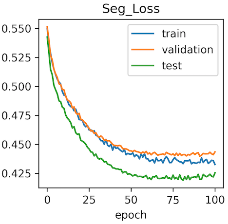

# Project journal
## Implementing binary single output channel

|Start Date|End Date  |
|----------|----------|
|2020-04-25|2020-04-26|

### Description

Implemented binary prediction for the existing multi-Class attention-gated Unet
ie. the unet can now also output a single binary channel

### Delivrables

- [x] Dice loss with binary channel
- [x] Visualisation, prediction and plotting for binary channels

|2 output channels|1 output channel  |
|----------|----------|
| | |

### Conclusion

- Unet is correctly implemented
- Multi-channel prediction remains superior in terms of convergence  

##  Focal Tversky loss

|Start Date|End Date  |
|----------|----------|
|2020-04-26|2020-04-26|

Implemented focal Tversky (FT) loss function with multi-channel output.  

|FT-Loss over time|Dice over time with FT as loss  |
|----------|----------|
| | |

### Conclusion

- Focal tversky loss performs well
- Similar overall performance when comparing to dice loss with 2 output channels
- Maybe more accurate on small segments
- Maybe more prone to overfitting

## Standardisation 

|Start Date|End Date  |
|----------|----------|
|2020-06-01|2020-06-30|

Contributor: [Quentin Uhl](https://github.com/QuentinUhl)

Implemented image-wise standardisation to obtain zero mean and unit standard deviation. 

|Dice without standardisation|Dice with standardisation  |
|----------|----------|
| <br/><br/> Best Validation Dice:  0.211099805|   <br/><br/> Best Validation Dice:  0.222637893|

### Conclusion

- Standardisation seems to improve performance slightly.
- However, stability (and resistance to overfitting?) seems to be worse.

## Optimisation algorithm 

|Start Date|End Date  |
|----------|----------|
|2020-07-10|2020-07-13|

Tested adam optimizer and learning rate adaptation "Plateau" policy, as this combination has been reported to perform particularly with our architecture on the [MLEBE dataset](https://github.com/Jimmy2027/MLEBE). 
We thus compare stochastic gradient descent (SGD) with Adam as optimizer as well as a "Step" vs a "Plateau" learning rate adaption strategy. 

Definitions of learning rate strategies:
````python
from torch.optim.lr_scheduler import StepLR, ReduceLROnPlateau
# Step:
StepLR(optimizer, step_size=250, gamma=0.5)
# Plateau
ReduceLROnPlateau(optimizer, mode='min', factor=0.1, threshold=0.01, patience=5)
````

|Optimizer & LR policy | SGD | Adam  |
|----------|----------|----------|
| Step LR |  <br/><br/> Best Validation Dice:  0.222637893 <br/> Epoch: 186 |   <br/><br/> Best Validation Dice:  0.201341671 <br/> Epoch: 115|
| Reduce LR on plateau |  <br/><br/> Best Validation Dice:  0.080664843 <br/> Epoch: 67|   <br/><br/> Best Validation Dice:  0.20092963 <br/> Epoch: 123|

### Conclusion

- SGD with LR step policy still seems to perform best on the gsd dataset. 
- Adam seems to train faster. 
- LR plateau policy seems to offer more stability for Adam
- LR plateau policy performs terribly with SGD

As some future architectural changes might change the outcome of this comparison, SGD with LR step vs. Adam with plateau should be integrated in a future hyperoptimisation.

## Weight decay

|Start Date|End Date  |
|----------|----------|
|2020-07-25|2020-07-26|

Evaluated weight decay to reduce overfitting. 

|Model |Lambda 10<sup>-4</sup> | Lambda 10<sup>-2</sup>  | Lambda 10<sup>-1</sup>| 
|----------|----------|----------|----------|
| Dice Loss | | | |
| Best validation class 1 dice |0.224319922| 0.22760875| 0.200507353
| Best validation epoch | 120|219| 99

### Conclusion

- Adjusting weight decay is effective in reducing overfitting.
- However, weight decay slows down overall learning
- At lambda 10<sup>-1</sup>, weight decay begins to hurt performance
- Weight decay should be integrated in a future grid search


##  Combined loss

|Start Date|End Date  |
|----------|----------|
|2020-07-17|2020-07-31|

Inspired by the [work by Yu et al](https://jamanetwork.com/journals/jamanetworkopen/fullarticle/2762679), we evaluated a combined loss defined as follows:

Combined loss: `Loss = Weighted binary cross entropy + L1 loss + 0.5×(1 – DSC) + 0.25×Volume loss`

|Loss|Loss Evolution|Dice over time| Best validation dice | Best validation epoch |
|----------|----------|----------|----------|----------|
|Dice loss| | | 0.222637893 | 186 |
|L1 loss| | | 0.005964876 | 14 |
|WBCE loss| | | 0.127579561 | 172 |
|Volume + Dice loss| | | 0.210912979 | 176 |
|Combined Loss| | | 0.20187068 | 106 |

### Conclusion

- combined loss seems to converge slightly faster
- combined loss yields worse results than dice loss alone

# TODO

- Implement augmentation
- implement combined loss
